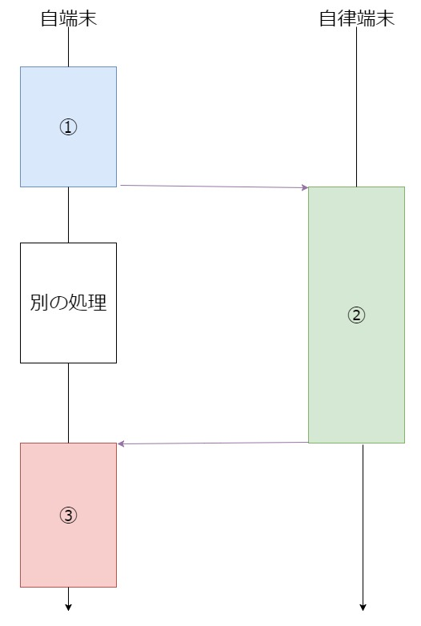
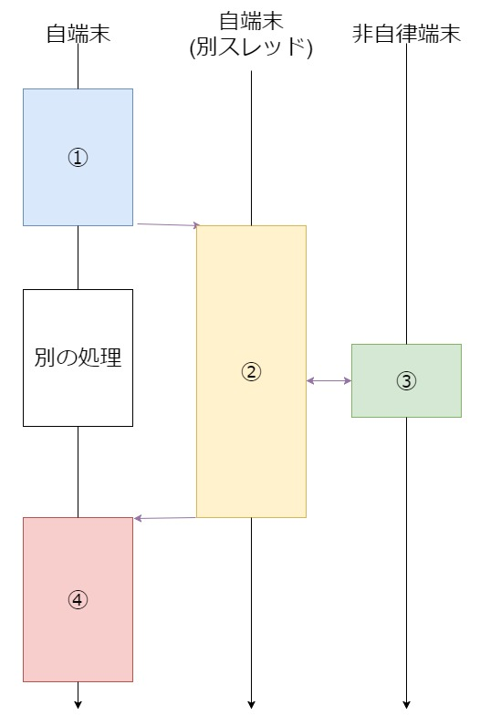

# DistributedTask
卒論で作ったやつ

## 概要
Task-Likeとawaitableを使ってasync/awaitを強くする  
卒論ではユビキタスコンピューティング環境において自律端末(プログラムを実行できる高性能な端末)と非自律端末(センサーの値を返すことしかできないような単機能な端末)とに分け、それぞれでasyncメソッドの挙動を変えようってことをした。  

自律端末のフロー図

非自律端末のフロー図

## 補足
通信処理は考えていないし引数にも対応していないので、引数・戻り値などの同期処理も必要  
インスタンスメソッドの場合はインスタンスの同期も必要